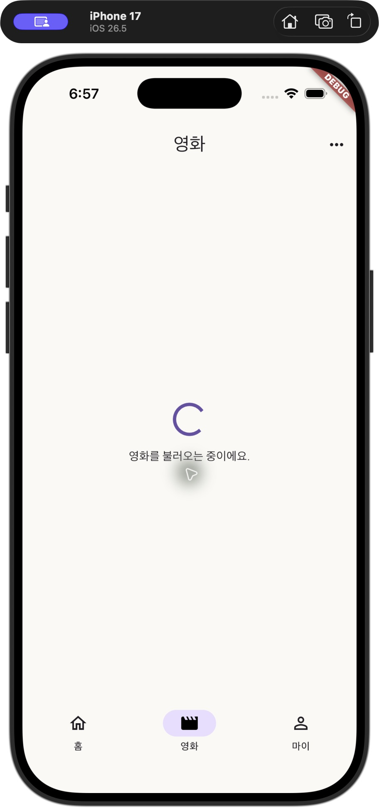
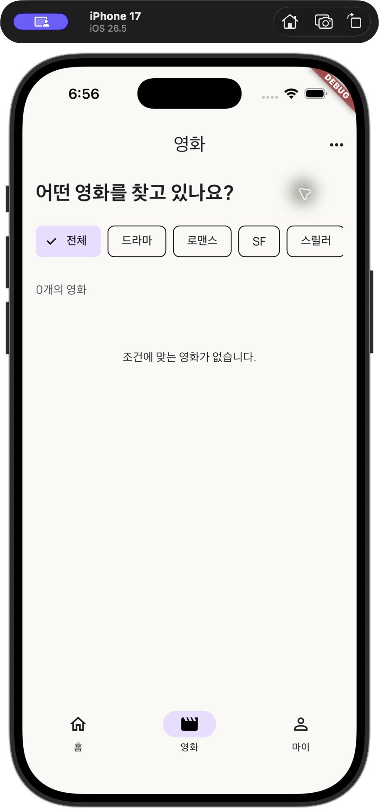
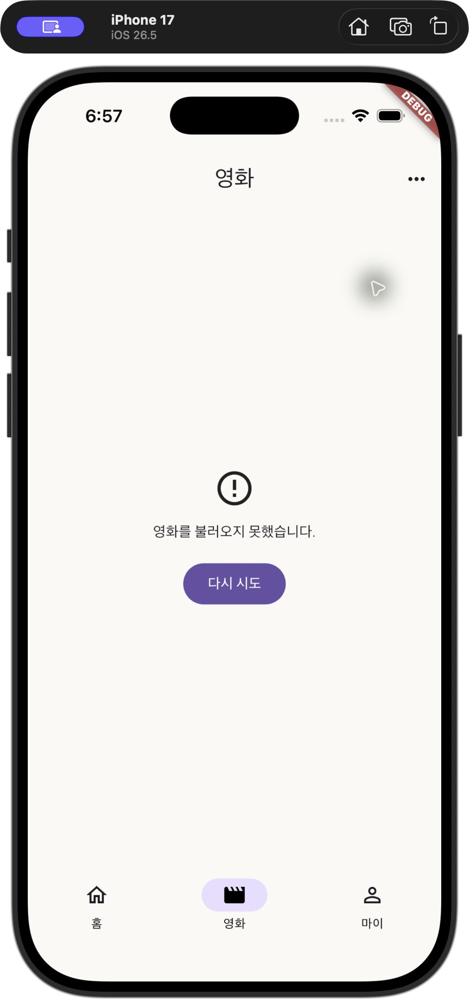
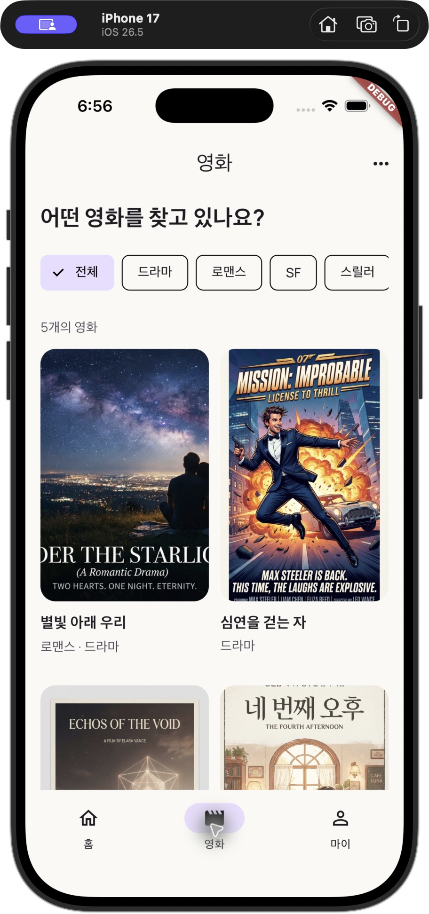
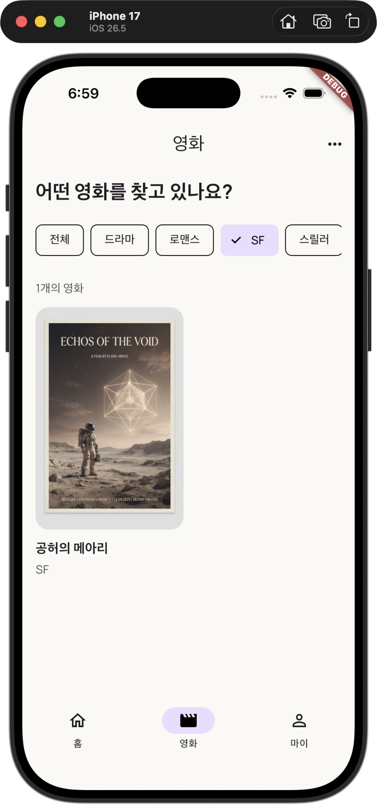

# 4주차 Required Mission

## 구현

- `FakeMovieService.fetchMovies()`는 1초 뒤 성공 목록, 빈 목록 또는 `MovieLoadException`을 반환합니다.
- `MovieListScreen.initState()`에서 영화 목록과 저장된 장르를 함께 읽는 Future를 준비합니다.
- `FutureBuilder`는 Loading → Error → Empty/Success 순으로 상태를 분기합니다.
- Loading, Empty, Error, 영화 Grid를 각각 별도 Widget으로 구성했습니다. 기존 Movie 모델과 MovieCard를 재사용합니다.
- 다시 시도 버튼은 새로운 Future를 만들고 성공 모드로 다시 요청합니다. 이전 결과가 남아 있어도 로딩 화면을 먼저 표시합니다.
- 장르를 변경하면 이미 불러온 목록을 필터링하므로 영화 요청을 다시 실행하지 않습니다.
- `SharedPreferencesAsync`의 `selected_genre` 키에 선택 장르만 저장합니다. 저장된 값이 없거나 지원하지 않는 값이면 `전체`로 시작합니다.
- 빠른 장르 변경도 선택 순서대로 저장합니다. 저장 실패 후 화면에서 안내할 때는 `mounted`를 확인합니다.
- API 교체 경계에 `TODO(5주차 유저별 평점 조회 API)`를 추가했습니다.

## 화면 확인 방법

1. 앱을 실행하고 영화 탭에 들어갑니다. 약 1초 동안 로딩 표시 후 영화 목록이 나타납니다.
2. 개발 모드에서 영화 화면 오른쪽 위 메뉴를 열어 `빈 목록`을 선택합니다. 로딩 뒤 빈 목록 안내가 나타납니다.
3. 같은 메뉴의 `오류 발생`을 선택합니다. 오류 안내와 `다시 시도` 버튼이 나타납니다.
4. `다시 시도`를 누르면 Loading → Success로 전환됩니다.
5. `SF` 장르를 선택하면 영화 한 편이 표시됩니다. 앱을 종료했다가 다시 실행한 후 영화 탭에서 `SF`가 복원되는지 확인합니다.

학습용 상태 전환 메뉴는 개발 모드에서만 표시됩니다. 배포 모드에서는 기본 성공 모드로 동작합니다.

## 자동 검사

- `flutter analyze`: 오류 없음.
- `flutter test`: 17개 통과.
- 자동 검사는 네 상태, 오류 후 재시도, 장르 저장 및 새 화면에서 복원, 잘못된 저장값 처리, 부모 화면 재구성 시 중복 요청 방지, 로딩 중 화면 제거를 포함합니다.
- 저장 테스트는 메모리 기반 플랫폼 대역을 사용합니다. iPhone 17 시뮬레이터에서도 앱을 완전히 종료하고 다시 실행한 후 SF 선택과 영화 한 편이 복원되는 것을 확인했습니다.

## 제출 자료

Loading, Empty, Error/재시도, Success 화면과 앱 재실행 후 장르 복원 영상, PR 링크를 제출 페이지에 첨부합니다.

## 시뮬레이터 확인 결과

네 상태와 오류 후 재시도 성공, SF 장르 저장 후 앱 종료·재실행 시 복원을 확인했습니다.

| Loading | Empty | Error |
| --- | --- | --- |
|  |  |  |

| Success | 앱 재실행 후 SF 복원 |
| --- | --- |
|  |  |

화면 캡처는 준비되어 있습니다. 제출용 재시도·앱 재실행 영상과 PR 링크는 별도로 준비해야 합니다.
